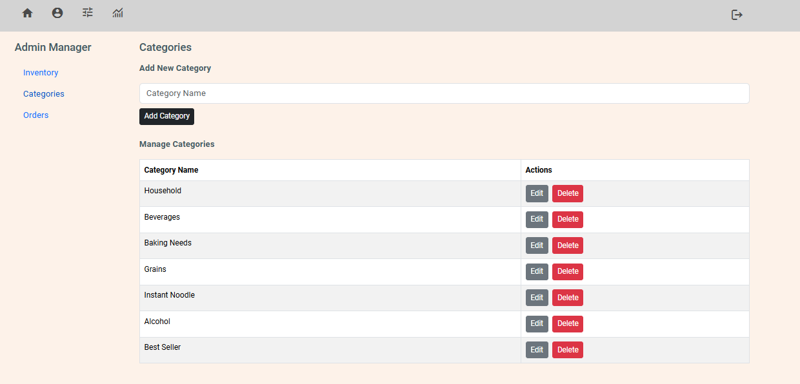

# Uncle Thomas Minimart App

Welcome to the Uncle Thomas Minimart App, a convenient, easy-to-use digital solution designed for small businesses like Uncle Thomas' minimart. Uncle Thomas, a key persona in our project, is a friendly neighborhood shop owner looking to modernize his operations without getting overwhelmed by complex technology. This app is tailored to meet his specific needs, streamlining day-to-day operations and helping him serve his customers more efficiently.

### Objectives (MVP)

- Satisfy user stories based on client needs and developer recommendations
- Address and resolve client pain points
- Enhance security measures

### Add-on (Stretch Goals)

- Data analysis page for client to understand his online business performance

### Agile Development Process

#### Sprint 1: Project Kickoff and Planning
- **Idea Generation:** Define the MVP and personas based on the concept of developing an e-commerce app.
- **Personas:** Identify the required personas and their pain points.
- **User Research:** Analyze and document the pain points of the defined personas.
- **Competitive Research:** Investigate similar e-commerce apps to identify best practices and unique features for implementation.
- **Define MVP:** Establish a clear set of user stories outlining the minimum viable product (MVP) that addresses key user needs.
- **Wireframing:** Create wireframes for core user interfaces using Figma, focusing on user flow and layout.
- **Tech Stack:** Define the tech stack used for this project.

#### Sprint 2: Development Feature 1.0
- **User Testing:** Conduct initial usability testing with Uncle Thomas (the persona) to gather feedback on the wireframes and adjust designs accordingly.
- **Final Design:** Develop prototypes using React based on the wireframes, ensuring alignment with user stories.
- **Frontend Development:** Build the user interface using React and integrate components from React-Bootstrap.
- **Backend Setup:** Set up the Flask framework and establish the initial API routes for product retrieval and user authentication. Configure Amazon S3 storage for product images.
- **Database Configuration:** Design the PostgreSQL database schema based on the defined data model.

#### Sprint 3: Development Feature 2.0
- **Frontend Development:** Implement core features such as shopping cart functionality, order management, and address handling. Set up and integrate Stripe API for seamless payment processing.
- **Backend Development:** Establish API endpoints for managing the shopping cart, orders, and addresses.
- **Conduct Testing:** Ensure each feature operates seamlessly according to user stories and delivers the requirements of the MVP.

#### Sprint 4: Release 1.0
- **Deployment of MVP:** Verify that the deployed product functions correctly on the live domain and that all features operate as expected compared to the local development version.

#### Project Timeline: 3 Weeks

### Personas (Fictional Person)

- **Client:** Uncle Thomas

- **Role:** Minimart owner with several chains in the neighborhood.

- **Age:** 60+

### Pain Points

1. **Loyal Customer Loss:**
   Uncle Thomas is concerned about losing loyal customers who have moved away from the area where his physical store is located. He believes these customers are also unhappy about not being able to support his business, which they have enjoyed for its friendly service.
    

2. **Business Succession and Modernization:**
   As Uncle Thomas ages, he is eager to pass his business on to his children. However, his children are hesitant to take over due to:
    
   - **Business Model Concerns:** They do not believe that the current business model will grow and are concerned that it may not be sustainable in the long term, especially with the rise of e-commerce.
      
   - **E-Commerce Interest:** They suggest that if Uncle Thomas invests in e-commerce, they would be more interested in taking over and managing that aspect of the business.

### User Stories

1. As a consumer, I want to browse products by category
   I want to see a list of product categories and browse items within a selected category.
    
2. As a consumer, I want to search for products by keyword
   I want to search for products by entering a keyword to quickly find what I need.
    
3. As a consumer, I want to view detailed information about a product
   I want to be able to click on a product to see more details about it before purchasing.
    
4. As a consumer, I want to add items to my cart and manage my cart
   I want to be able to add items to my cart and review or update the items before purchasing.
    
5. As a consumer, I want to proceed to checkout and enter my shipping details
   I want to provide my shipping address and payment details to complete the purchase.
    
6. As a consumer, I want to view my order history
   I want to see all my previous orders in one place so I can track them or reorder.
    
7. As a registered user, I want to log in and manage my profile
   I want to log in with my credentials to access my profile and order history.
    
8. As an admin, I want to manage the product inventory
   I want to add, edit, or remove products in the store to keep the inventory up to date.
    
9. As an admin, I want to process customer orders
   I want to view and manage customer orders to fulfill them.
    
10. (Stretch Goal) As an admin, I want to view business analytics
    I want to see sales data and reports to analyze the performance of the minimart.

### UI/UX Wireframing

- **Figma**: [View Wireframes](https://www.figma.com/design/RkYVGK7fwjMo69p2ts1xDt/Uncle-Thomas-Minimart?m=auto&t=MHsQcLfRoKFhCT4z-1)

### Data Model - ERD

- **dbDiagram.io**: [View ERD](https://dbdiagram.io/d/Uncle-Thomas-Minimart-15-Sep-2024-66e5bfe26dde7f41491dd8be)
   
  

### Frontend

- **React JS (Vite)**: Modern JavaScript framework for building user interfaces.

- **React-Bootstrap**: For pre-designed UI components.

### Backend

- **Python**: Programming language for backend development.
- **Flask**: Web framework for creating the backend API.
- **Flask-CORS**: Extension for handling Cross-Origin Resource Sharing (CORS).
- **Flask-Bcrypt**: Library for password hashing.
- **Flask-JWT-Extended**: Extension for handling JSON Web Tokens (JWT).
- **Psycopg3**: PostgreSQL adapter for Python.
- **Amazon S3**: File Storage (for product images)
- **Stripe**: Payment API

### Backend Database

- **PostgreSQL**: For backend database needs

### Security

- **User Route Protection:** Prevents unauthorized access to protected routes.

- **Token Revocation:** Uses JTI blacklist to revoke JWTs.

### Backend API Tester

- **Postman:** For backend API route testing

### Consumer Pages

##### Sign In / Register

  
   

##### Store Page

##### Product Page

##### Orders Page

##### Cart Page

##### Checkout Page

##### Payment Page (Using Stripe Session)

### Admin Pages

##### Inventory

##### Category Manager

##### Order Manager

#### References

Flask

- How to setup Flask and Psycopg
  https://blog.teclado.com/first-rest-api-flask-postgresql-python/
  https://www.psycopg.org/psycopg3/docs/api/cursors.html
- How to setup Flask
  https://flask.palletsprojects.com/en/3.0.x/quickstart/
- How to deploy Flask App with render.com
  https://docs.render.com/deploy-flask
- Flask JWT Extended
  https://flask-jwt-extended.readthedocs.io/en/stable/
- JWT Revoking
  https://flask-jwt-extended.readthedocs.io/en/stable/blocklist_and_token_revoking.html

- SQLAlchemy (not used in this project)
  https://dev.to/francescoxx/build-a-crud-rest-api-in-python-using-flask-sqlalchemy-postgres-docker-28lo

Python Command Line Arg

- https://medium.com/pythons-gurus/python-sys-module-beginner-guide-e7585684c26c
- https://www.geeksforgeeks.org/command-line-arguments-in-python/

Stripe Payment API

- https://docs.stripe.com/payments/accept-a-payment

Amazon S3 API

- Amazon S3 with Flask
  https://flask-s3.readthedocs.io/en/latest/

How to build API Routes in Flask

- https://www.turing.com/kb/build-flask-routes-in-python

React Axios Library

- https://axios-http.com/docs/example

PostgreSQL

- https://www.postgresqltutorial.com/postgresql-tutorial/postgresql-insert/

- https://www.datacamp.com/cheat-sheet/postgre-sql-basics-cheat-sheet
